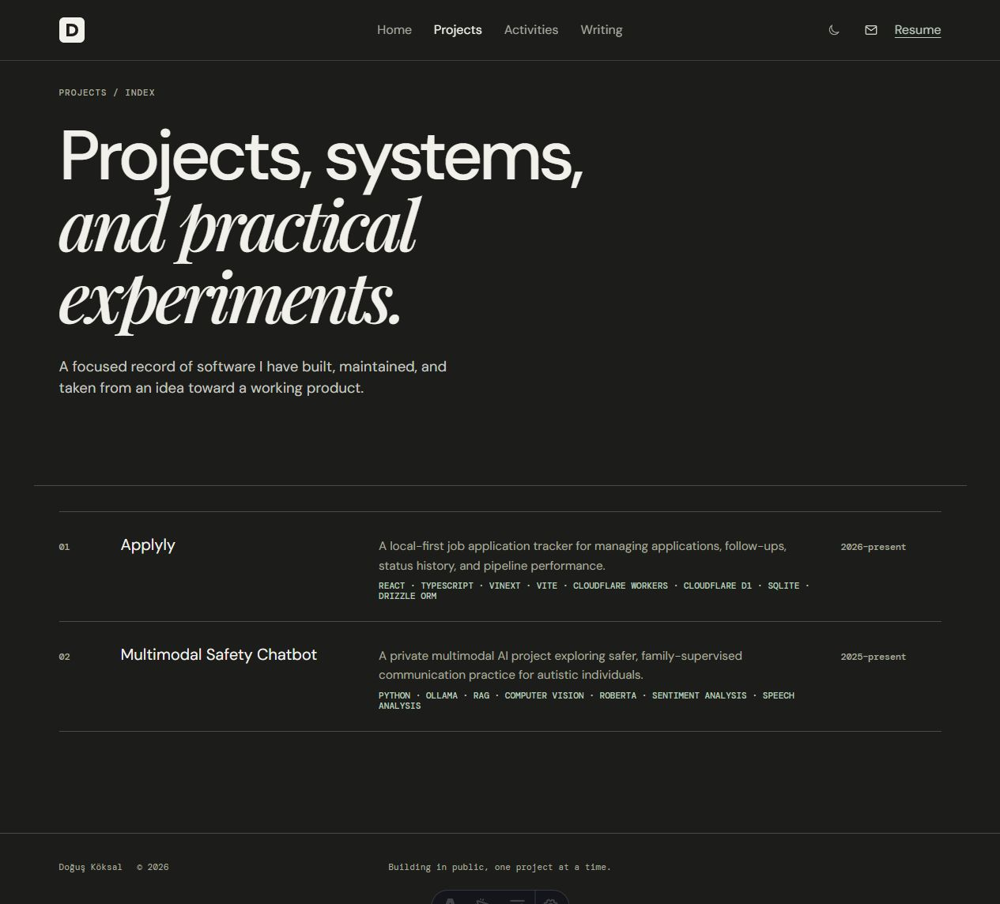

# doguskoksal.com

The source for [doguskoksal.com](https://www.doguskoksal.com), Doğuş Köksal's software engineering portfolio. The site presents selected projects, professional experience, technical evidence, current focus, and contact details in a restrained editorial layout.

## Stack

- Astro 7 with static output
- TypeScript and Astro content collections
- Hand-authored CSS with responsive and reduced-motion behavior
- Markdown project case studies

## Local setup

Requirements: a current Node.js release and npm.

```sh
npm install
npm run dev
```

Useful commands:

```sh
npm run build
npm run preview
```

`npm run build` writes the production-ready static site to `dist/`.

## Architecture

- `src/layouts/BaseLayout.astro` contains the shared document shell, navigation, theme controls, and footer.
- `src/pages/` defines the homepage, project index, project detail routes, and generated sitemap.
- `src/content/work/` stores project case studies and publication metadata.
- `src/lib/projects.ts` provides the shared published-project query used by pages and the sitemap.
- `src/data/site.ts` is the single source for site-wide metadata and display dates.
- `src/styles/global.css` contains the visual system, responsive rules, and accessibility preferences.
- `public/` contains static assets, favicons, and the downloadable résumé.

Project pages and sitemap entries are generated from published entries in the `work` content collection. Setting a project's `status` to `published` makes it eligible for the project index, detail route, and sitemap.

## Accessibility

The site includes a skip link, semantic landmarks, active-page navigation state, keyboard-visible focus styles, an explicit theme preference with selected-state feedback, and reduced-motion handling for decorative and interface animations.

## Deployment

The project does not depend on a platform-specific adapter. Build it with `npm run build`, then deploy the generated `dist/` directory to a static host. Canonical and sitemap URLs use `https://www.doguskoksal.com` from the shared site configuration.

## Screenshots


